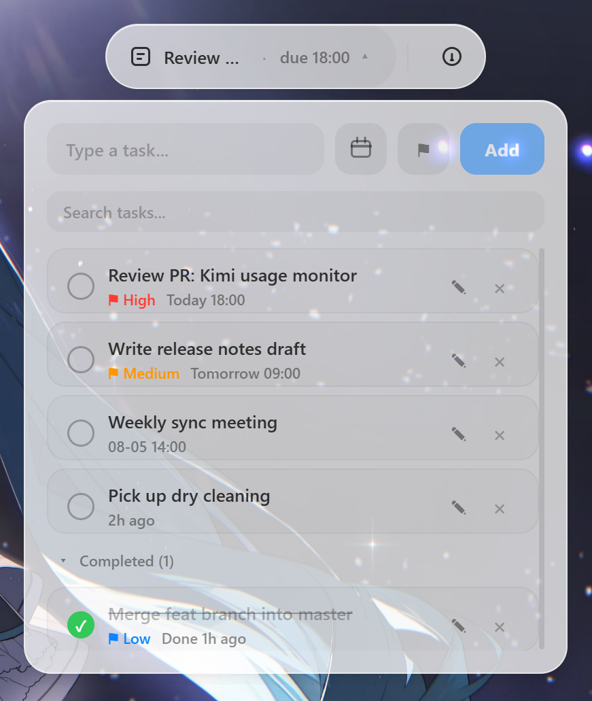
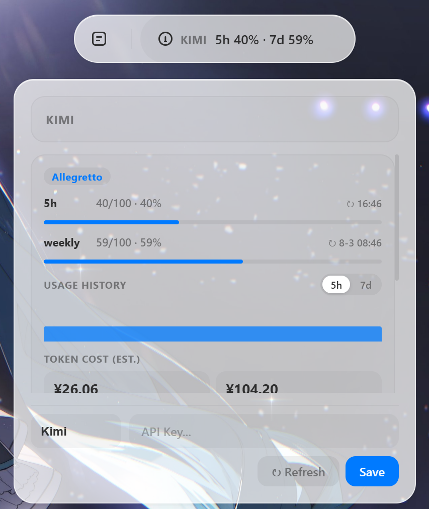

# Memo Pill

[English](README-en.md) | **中文**

一个轻量级的 Windows "灵动岛"风格浮动组件，灵感来自 Apple 的 Dynamic Island 设计。使用 [Dioxus](https://dioxuslabs.com/) 构建。

## 界面预览

| 任务面板 | Kimi 用量监控 |
| --- | --- |
|  |  |

## 项目状态

v1.0.0 正式版 —— 一个面向个人使用的桌面工具，初版规划的功能（快速任务、Coding Plan 用量追踪）均已落地。

## 功能

- **双侧灵动岛**
  - 日常以 48px 小圆悬浮于屏幕顶部居中
  - 悬停左侧平滑展开任务胶囊（280px），按紧急度显示一条任务内容（超长省略号截断，悬停显示全文），滚动滚轮循环切换；无任务时显示 All done / No tasks
  - 悬停右侧平滑展开 Coding Plan 胶囊，轮播显示各模型厂商的余额 / 用量，滚轮循环切换；左右互切与圆球展开共用同一套弹性动画
  - 点击胶囊展开对应面板（任务面板 400px / Coding Plan 面板），再次点击收拢
  - 鼠标移开 1 秒后自动收回小圆
- **快速任务** — 回车即记录，属性全可选：截止时间（今天 / 明天 / +7 天 / 自选日期时间）、⚑ 三级优先级旗帜（低 / 中 / 高，点击循环切换）；点击任务左侧圆圈完成，划线沉入"已完成"分组，再点恢复；逾期任务红色高亮，到期前 10 分钟岛自动展开并闪烁对应任务提醒；编辑模式同样可修改截止与优先级；删除后 6 秒内可撤销，5 条以上可搜索，长文本悬停显示全文
- **Coding Plan 用量追踪** — 支持 Kimi / DeepSeek / MiniMax / GLM 四家厂商，面板内录入 API key 后自动拉取余额与配额用量，可手动刷新；Kimi 额外显示套餐名与 5 小时 / 每周配额进度、配额历史柱状图（悬停查看该周期费用与 token 消耗），并基于本地会话日志估算 token 费用；key 仅保存在本地
- **小圆表情与时钟** — CSS 绘制的眨眼小脸（8 种表情随机轮换，含爱心眼、困倦呼吸、晕眩等）与 HH:MM 时钟每 5 秒交替
- **纯 CSS 单色图标** — 胶囊上的便签与额度图标、面板输入框旁的日历按钮均为 CSS 绘制的黑白灰图标，日历随按钮状态（悬停 / 已设截止）自动变色
- **顺滑动画** — 非对称弹性展开/收拢曲线、果冻回弹、内容交叉淡入淡出
- **无闪烁渲染** — 窗口固定尺寸永不 resize（规避 WebView2 resize 闪帧），透明区域点击穿透，不遮挡下层应用

### 交互

| 操作 | 效果 |
| --- | --- |
| 鼠标悬停左侧 / 右侧 | 小圆展开为任务胶囊 / Coding Plan 胶囊 |
| 左右横穿胶囊 | 一侧缩小、另一侧展开，弹性互切 |
| 移开鼠标 | 1 秒后收拢回小圆 |
| 左键点击胶囊 | 展开 / 收拢对应面板（任务 / Coding Plan） |
| 胶囊上滚动滚轮 | 循环切换显示的任务 / 模型厂商 |
| Esc / 点击面板外空白处 | 收拢面板 |
| 任务左侧圆圈 | 完成 / 恢复任务 |
| 输入框旁日历 / ⚑ 按钮 | 为新任务设置截止时间 / 优先级 |
| 编辑中的 chips 行 | 修改该任务的截止时间与优先级 |
| Coding Plan 面板 | 选择厂商、录入 API key、刷新余额 |
| Shift + 左键拖动 | 移动窗口位置（重启后保持） |
| 右键（小圆 / 胶囊上） | 退出应用 |

## 下载

Windows 10 / 11（x64）用户可直接从 [GitHub Releases](https://github.com/cp990207/cp_de_island/releases) 下载 `memo-pill-vX.Y.Z-windows-x86_64.zip`，解压后保持 `memo-pill.exe` 与 `WebView2Loader.dll` 在同一目录，双击 `memo-pill.exe` 运行。

- 首次运行若被 SmartScreen 拦截，选择"更多信息 → 仍要运行"（exe 未做数字签名）。
- 依赖 WebView2 Runtime（Windows 11 及较新的 Windows 10 已预装；缺失时请安装 [Evergreen Runtime](https://developer.microsoft.com/microsoft-edge/webview2/)）。

## 技术栈

- **语言**: Rust
- **UI 框架**: Dioxus 0.7.9（桌面模式）
- **异步定时**: tokio
- **本地时间**: time
- **网络请求**: reqwest
- **Win32 交互**: windows-sys（点击穿透 / 热区命中检测）
- **序列化**: serde + serde_json
- **ID 生成**: uuid v4

## 构建与运行

```bash
cargo build
cargo run
```

> 在 Windows + Rust (windows-gnu) 工具链下，请确保 MinGW 已加入 PATH 并可用，同时 `libshlwapi.a` 文件可用。常见构建问题详见项目根目录的 `AGENTS.md`。

## 数据存储

任务数据以 JSON 格式持久化存储于 `%APPDATA%/MemoPill/memos.json`。写入采用临时文件 + 原子替换；数据文件损坏时会自动备份为 `memos.corrupt-<时间戳>.json`，不会被覆盖。旧版本（纯笔记）数据文件加载后自动兼容升级。应用为单实例运行，避免多开互相覆盖数据。窗口位置（Shift+拖动后）保存在同目录的 `settings.json`，重启后恢复；若保存的位置已不在任何显示器范围内（如显示器布局变更），则回退到顶部居中。Coding Plan 的 API key 保存在同目录的 `providers.json`，Kimi 配额历史保存在 `kimi-quota-history.json`，均仅存储于本地。

## 许可证

[MIT](LICENSE)
